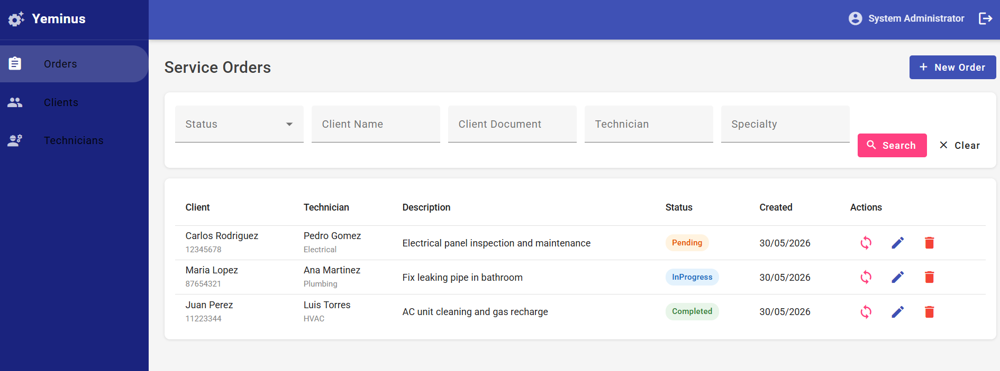
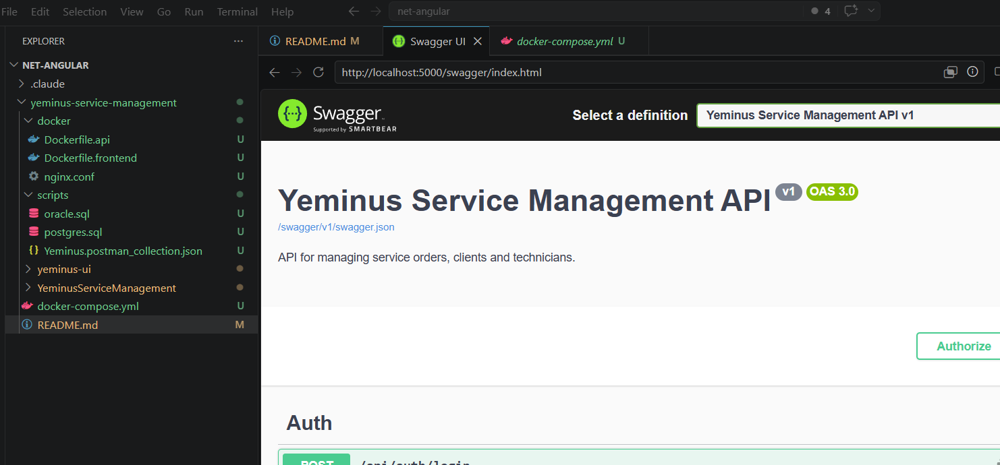
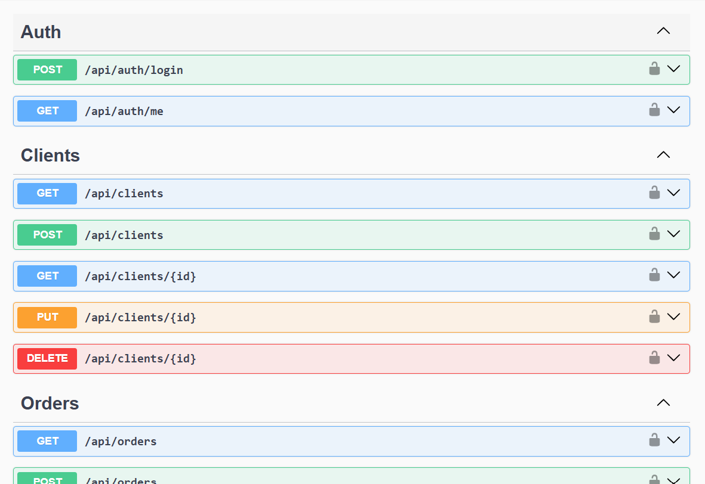
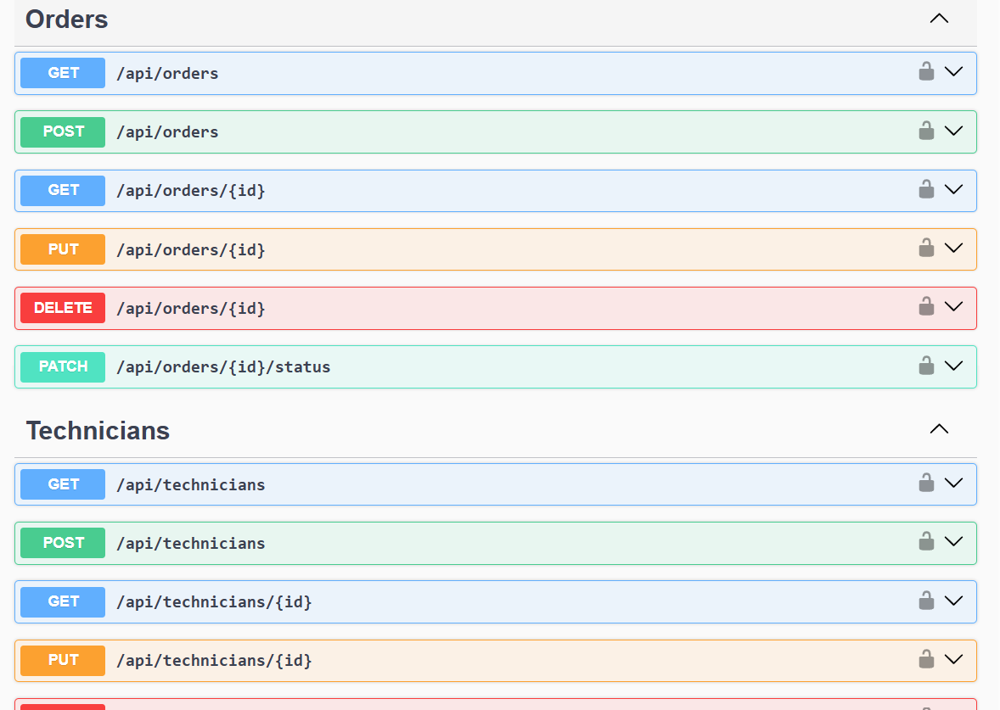
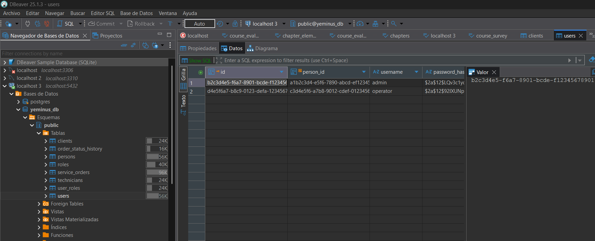

# Yeminus Service Management

Sistema de gestión de órdenes de servicio para empresa de mantenimiento.







## Stack Tecnológico

| Capa | Tecnología |
|------|-----------|
| Backend | .NET 10 Web API |
| Base de datos | PostgreSQL / Oracle |
| ORM / Acceso a datos | Dapper + SQL nativo |
| Autenticación | JWT (BCrypt passwords) |
| Frontend | Angular 21 + Angular Material |
| Contenedores | Docker + Docker Compose |
| Tests | xUnit + Moq |
| Logging | Serilog |
| Documentación API | Swagger / OpenAPI |

---

## Arquitectura

Clean Architecture con 4 capas:

```
YeminusServiceManagement/
├── Yeminus.Domain          # Entidades, Enums, Interfaces, Excepciones
├── Yeminus.Application     # DTOs, Servicios, Validadores (FluentValidation)
├── Yeminus.Infrastructure  # Repositorios Dapper, Connection Factories, Security
└── Yeminus.Api             # Controllers, Middleware, Configuración
```

### Patrones implementados
- Repository Pattern
- Factory Pattern (selección PostgreSQL/Oracle)
- Dependency Injection
- DTO Pattern

---

## Requisitos

### Desarrollo local
- [.NET 10 SDK](https://dotnet.microsoft.com/download)
- [Node.js 22+](https://nodejs.org/)
- [PostgreSQL 16+](https://www.postgresql.org/) o Docker

### Docker
- [Docker Desktop](https://www.docker.com/products/docker-desktop/)
- Docker Compose v2+

---

## Instalación y Configuración

### 1. Clonar / abrir el proyecto

```bash
cd yeminus-service-management
```

### 2. Configurar base de datos PostgreSQL

**Opción A - Docker (recomendado):**
```bash
docker run -d --name yeminus_postgres \
  -e POSTGRES_DB=yeminus_db \
  -e POSTGRES_USER=postgres \
  -e POSTGRES_PASSWORD=postgres \
  -p 5432:5432 postgres:16-alpine
```

**Opción B - PostgreSQL local:**
```sql
CREATE DATABASE yeminus_db;
```

### 3. Ejecutar el script SQL

```bash
psql -U postgres -d yeminus_db -f scripts/postgres.sql
```

---

## Ejecución Backend

```bash
cd YeminusServiceManagement/Yeminus.Api
dotnet restore
dotnet run
```

API disponible en: `http://localhost:5000`  
Swagger UI: `http://localhost:5000/swagger`

### Variables de entorno (appsettings.json)

```json
{
  "DatabaseProvider": "PostgreSQL",
  "ConnectionStrings": {
    "DefaultConnection": "Host=localhost;Port=5432;Database=yeminus_db;Username=postgres;Password=postgres"
  },
  "JwtSettings": {
    "Secret": "YeminusServiceManagementSuperSecretKey2024!!",
    "Issuer": "YeminusApi",
    "Audience": "YeminusClient",
    "ExpirationMinutes": 480
  }
}
```

---

## Ejecución Frontend

```bash
cd yeminus-ui
npm install
npm start
```

Frontend disponible en: `http://localhost:4200`

---

## Ejecución con Oracle

1. Cambiar `DatabaseProvider` a `"Oracle"` en `appsettings.json`
2. Configurar la cadena de conexión `OracleConnection`
3. Ejecutar `scripts/oracle.sql` en tu instancia Oracle
4. Reiniciar la API

---

## Docker Compose (Todo en uno)

```bash
# Levantar todos los servicios
docker-compose up -d

# Ver logs
docker-compose logs -f api

# Detener
docker-compose down
```

### Servicios disponibles

| Servicio | URL |
|---------|-----|
| API | http://localhost:5000 |
| Swagger | http://localhost:5000/swagger |
| Frontend | http://localhost:4200 |
| PostgreSQL | localhost:5432 |

---

## Usuarios de prueba

| Usuario | Contraseña | Rol |
|---------|-----------|-----|
| `admin` | `Admin123!` | Admin |
| `operator` | `Operator123!` | Operator |

---

## API Endpoints

### Autenticación
| Método | Endpoint | Descripción |
|--------|----------|-------------|
| POST | `/api/auth/login` | Iniciar sesión |
| GET | `/api/auth/me` | Usuario actual |

### Clientes
| Método | Endpoint | Descripción |
|--------|----------|-------------|
| GET | `/api/clients` | Listar clientes |
| GET | `/api/clients/{id}` | Obtener cliente |
| POST | `/api/clients` | Crear cliente |
| PUT | `/api/clients/{id}` | Actualizar cliente |
| DELETE | `/api/clients/{id}` | Eliminar cliente |

### Técnicos
| Método | Endpoint | Descripción |
|--------|----------|-------------|
| GET | `/api/technicians` | Listar técnicos |
| GET | `/api/technicians/{id}` | Obtener técnico |
| POST | `/api/technicians` | Crear técnico |
| PUT | `/api/technicians/{id}` | Actualizar técnico |
| DELETE | `/api/technicians/{id}` | Eliminar técnico |

### Órdenes de Servicio
| Método | Endpoint | Descripción |
|--------|----------|-------------|
| GET | `/api/orders` | Listar órdenes (con filtros) |
| GET | `/api/orders/{id}` | Obtener orden |
| POST | `/api/orders` | Crear orden |
| PUT | `/api/orders/{id}` | Actualizar orden |
| DELETE | `/api/orders/{id}` | Eliminar orden |
| PATCH | `/api/orders/{id}/status` | Cambiar estado |

### Filtros disponibles en GET /api/orders

```
?status=1           (1=Pending, 2=InProgress, 3=Completed)
?technicianName=Pedro
?specialty=Electrical
?clientName=Carlos
?clientDocument=12345678
?dateFrom=2024-01-01
?dateTo=2024-12-31
```

---

## Colección Postman

Importar el archivo `scripts/Yeminus.postman_collection.json` en Postman.

El script de Login guarda automáticamente el token JWT en la variable de colección `{{token}}`.

---

## Unit Tests

```bash
cd YeminusServiceManagement/Yeminus.Tests
dotnet test
```

### Cobertura de tests

| Servicio | Tests |
|---------|-------|
| AuthService | Login correcto, contraseña incorrecta, usuario inactivo, usuario no encontrado |
| ClientService | Crear cliente, documento duplicado, cliente no encontrado, eliminar |
| TechnicianService | Crear técnico, técnico no encontrado, request inválido |
| ServiceOrderService | Crear orden, cliente inexistente, técnico inexistente, cambio de estado, estado duplicado |

---

## Swagger

Al ejecutar en modo Development, Swagger UI está disponible en:
`http://localhost:5000/swagger`

Para autenticarse en Swagger:
1. Usar `POST /api/auth/login`
2. Copiar el token devuelto
3. Click en "Authorize" → ingresar `Bearer {token}`

---

## Estructura del proyecto

```
yeminus-service-management/
├── YeminusServiceManagement/
│   ├── Yeminus.Api/
│   │   ├── Controllers/           AuthController, ClientsController, TechniciansController, OrdersController
│   │   ├── Middleware/            ExceptionMiddleware
│   │   ├── Common/                ApiResponse<T>
│   │   └── Program.cs
│   ├── Yeminus.Application/
│   │   ├── DTOs/                  Auth, Clients, Technicians, Orders
│   │   ├── Services/              AuthService, ClientService, TechnicianService, ServiceOrderService
│   │   ├── Validators/            FluentValidation validators
│   │   └── Extensions/            ApplicationServiceExtensions
│   ├── Yeminus.Domain/
│   │   ├── Entities/              Person, User, Role, Client, Technician, ServiceOrder, OrderStatusHistory
│   │   ├── Enums/                 OrderStatus
│   │   ├── Interfaces/            IUserRepository, IClientRepository, etc.
│   │   └── Exceptions/            NotFoundException, DomainValidationException, UnauthorizedException
│   ├── Yeminus.Infrastructure/
│   │   ├── Persistence/
│   │   │   ├── ConnectionFactories/  PostgresConnectionFactory, OracleConnectionFactory, DbConnectionFactorySelector
│   │   │   └── Repositories/         Dapper repositories
│   │   ├── Security/              BcryptPasswordHasher, JwtTokenService
│   │   └── Extensions/            InfrastructureServiceExtensions
│   └── Yeminus.Tests/
│       └── Services/              Unit tests (xUnit + Moq)
├── yeminus-ui/
│   └── src/app/
│       ├── core/                  Services, Guards, Interceptors
│       ├── shared/                Layout, ConfirmDialog, Models
│       └── features/              auth, clients, technicians, orders
├── scripts/
│   ├── postgres.sql               Schema + seed data
│   ├── oracle.sql                 Schema compatible Oracle 19c+
│   └── Yeminus.postman_collection.json
├── docker/
│   ├── Dockerfile.api
│   ├── Dockerfile.frontend
│   └── nginx.conf
├── docker-compose.yml
└── README.md
```

---

